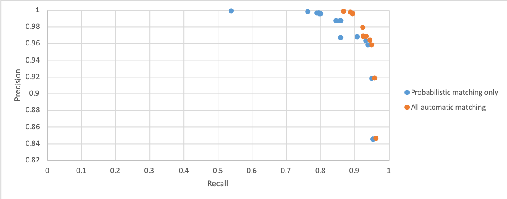

# Executive summary

In the 2011 Census, the matching of records between the Census and the follow-up coverage survey required significant manual effort to find matches that could not be found by automatic means. Since then, ONS have continued to develop methods of automated matching, including machine learning approaches.  Using automated methods alone, recall has improved from about $70\,\%$ to about $90\,\%$ with no loss of precision.

We describe the challenges inherent in continuing to improve this result to the point where ONS could achieve its goals solely through automated matching. We propose a number of possible directions for investigation. However, we are not able to say with confidence whether any of those directions would allow a 
completely automated process by the time of the next Census.

The structure of this document is as follows. In [Background] we review the challenge and the standard approaches in the literature; in [Progress since the 2011 Census] we review work that the ONS has done since the last Census; then, in [Can "Machine Learning" help?] we describe possible future directions. Finally, we offer some thoughts on next steps.

Background
==========

The UK Census and Census Coverage Survey
----------------------------------------

In the UK, the national census is carried out every 10 years in order to measure the population size and demographics. In some countries, the census count itself is published; the UK aims to provide a census *estimate*, adjusted for the "undercount" and "overcount" that occurs when people are missed or counted multiple times.

To calculate the census estimates, an independent enumeration of a sample of $1\,\%$ of postcodes known as the Census Coverage Survey (CCS) is carried out. The CCS takes place after the census and involves in-person interviews carried out at the selected addresses; data from the occupants is obtained for a small selection of the core census fields: first name, surname, date of birth, sex, marital status and address.

The 2011 UK census estimated that there are about 63.2 million people and 25.4 million households in the UK. The CCS sampled $1\,\%$ of postcodes, comprising about $650\,000$ people and $340\,000$ households. In the postcodes sampled by the CCS, about $95\,000$ individuals counted by the Census were not matched in the CCS; likewise, there were about $60\,000$ individuals counted by the CCS who were not matched in the Census. These figures are higher than the final estimates of under-enumeration because the sample postcodes were weighted towards areas where high under-enumeration was expected.

Calculating the census estimate relies on records from the CCS being correctly paired with census records that correspond to the same person (the same goes for matching households). This challenge, of *record matching,* is the central problem that the methods discussed in this document seek to address.

In 2011, most people filled out the census on provided paper forms, with $16\,\%$ of respondents choosing to do so online. A key difference in 2021 will be that, for most people, online forms will be the default, with paper forms only being provided upon request. One might anticipate that this will improve matching rates (because for electronic submissions it will no longer be necessary to process handwritten documents) but, on the other hand, the changes may impact the automated matching process (which was developed based on the kinds of challenges that occurred in the 2011 Census) and make it harder for us to estimate the effectiveness of our methods in advance.

The challenge of record matching in the Census
----------------------------------------------

The fundamental problem is that a single individual (or household) may have non-identical records in the Census and the CCS. This can occur when there is missing or incomplete information in one of the records, differences due to spelling mistakes or scanning errors, or other mistakes. In the literature, the problem of identifying which records actually refer to an identical individual is known as the problem of "record linkage," and we summarise the field in the section [Review of the "Record Linkage" problem], below.

Record matching between the CCS and Census is subject to strict precision and recall criteria: namely, a precision of at least $99.9\,\%$ and recall of at least $99.75\,\%$.

In 2011, $70\,\%$ of the people matches were made automatically, using a mixture of deterministic matching and probabilistic matching using the Fellegi-Sunter method.[^fs] For households, a deterministic method was used which matched $60\,\%$ automatically. Thus, around $30\,\%$ of people matches had to be made manually and this was done in two ways. First, in what is known as *clerical resolution*, a plausible matching pair of records is presented to the human assessor, who then decides whether this pair is in fact a match. Second, under *clerical searching*, a human searches manually for a match to a so-far unmatched record using whatever methods they deem helpful to narrow down or expand the search. The general term *clerical matching* refers to either process.

[^fs]: See the review section for details on the Fellegi-Sunter method.

The clerical matching procedure took the equivalent of 30 full-time staff all working for 30 weeks in 2011. In 2021, the deadline for completing the census matching will be only 8 weeks from when all the census and CCS returns are in.

Thus, ongoing work at ONS aims to minimise the need for clerical searching as part of the 2021 matching methodology and to speed up all clerical matching that is required. The slowness of clerical searching in 2011 owes much to the fact that, in order for a CCS record to be ruled out and considered a non-match, it must first be checked against every single census record for which there is currently no match.

Even after improvements ONS have already made to the automated matching methods (detailed later in the section [Progress since the 2011 Census]), ~$10\,\%$ of people records still remain to match manually (~$5\,\%$ for household records) when testing these methods on 2011 data. ONS predict that of these people matches, a further ~$7.5\,\%$ will be found by clerical resolution, leaving ~$2.5\,\%$ of matches still to make. The remaining matches could be included anywhere amongst the unmatched CCS records ($60\,000$ in 2011) and unmatched census records from CCS areas ($95\,000$ in 2011). Any method used to replace clerical searching for these very difficult matches should ideally also declare when records do not have a match, in order to avoid any residual need for clerical searching.

Review of the "Record Linkage" problem
--------------------------------------

In this section we briefly review the academic work on the general problem of record linkage.

The task of matching non-identical records from different databases that refer to the same entity is also known as  *instance identification*, *name matching*, *database hardening*, *merge-purge* and (when applied to a single database) *duplicate detection* [@Elmagarmid2007].

Record linkage problems deal with records that reference complex real world entities, such as people, with multiple data fields. The challenge is therefore greater than simply matching a single field, where commonly used string distance metrics such as the Levenshtein edit distance or Jaro-Winkler are suitable. Such metrics can, however, be used to compute a distance metric for the equivalent fields of two records, and this has been shown to be useful in matching census names in the face of typographical errors [@WilliamE.Yancey2005].

To avoid comparing every record in one database with every one in the other, there are a variety of different methods used to filter out extremely unlikely matches. A common example is *blocking*, where all record pairs that disagree on a blocking key are initially discarded. This key can be a particular field or combination of multiple fields [@Christen2012].

The methods used for the problem of record linkage fall into the three general categories: deterministic, probabilistic, and learning based methods. All of these methods work on the general premise of classifying record pairs as matches, non-matches, or, in some cases, indeterminate.

*Deterministic methods* use a set of rules based on a subset of the constituent fields of each record pair, known as a "matchkey". Pairs that do not match according to those rules are classified as non-matches. For example, a matchkey for a pairing of records that have two equivalent fields could be as follows: “*Field 1* must be an exact match and *Field 2* must have an edit distance less than 3.”

*Probabilistic methods* calculate the probability of each record pair being a
match or non-match. The most common approach, *Fellegi-Sunter* [@Fellegi1969],
is a Bayesian model, though typically one makes the simplifying assumption that
the probability is factorisable over the fields.[^naive] Pairs whose match
probability is sufficiently high are classified as a match; those sufficiently
low a non-match; and intermediate values may be sent out for clerical
matching. The probabilities used in the calculation are computed either by an
"expectation maximisation" (EM) algorithm or from labelled training data
[@Murray2018]. In either case, one would properly classify the algorithm as a
“machine learning” algorithm.

Some alternative machine learning methods for record linkage are discussed later in this document.

[^naive]: Known as the "naive Bayes" assumption.

Progress since the 2011 Census
==============================

Improvements in Census to CCS Record Linkage
--------------------------------------------

Since the 2011 Census, ONS have made improvements in both deterministic and probabilistic matching. As of November 2019, evaluating these methods on the known results from 2011, ~$90\,\%$ of people records and ~$95\,\%$ of household records from the 2011 census and CCS record data can be matched automatically (compared with $70\,\%$ and $60\,\%$ respectively with 2011 methods).[^gold]

[^gold]: Performance is measured against the “known truth” from 2011, which ultimately assumes that the manual matching process is perfect. There are, however, some small imperfections arising from undetected duplicates in the original data.

The table below shows the precision and recall[^defs] for the original 2011
automated matching process and as each improvement is added. Note that the
precision is always $100\,\%$: these methods are quite conservative.

[^defs]: The precision is “of those claimed to be a match, what fraction
    actually are?.” The recall is “of the actual matches, what fraction are
    claimed to be a match?”

|      | Method                 | Precision | Recall |
|------+------------------------+----------:+-------:|
| i.   | 2011                   |     1.000 |  0.700 |
| ii.  | Improved deterministic |     1.000 |  0.849 |
| iii. | Improved probabilistic |     1.000 |  0.882 |
| iv.  | With household         |     1.000 |  0.901 |

: Improvements in the automated matching of people records since 2011 and their performance against the 2011 “gold standard.” Note that the method of each row includes the improvements of previous rows. Row (i) shows the performance of automated methods as they were in 2011; the improvements captured by subsequent rows are described in the text.

### Deterministic methods

Row (ii) of the table above describes the impact of improvements in
deterministic matching. ONS have developed a set of matchkeys after studying the 2011 Census data. The matchkeys in particular add derived field variables which account for common errors in name fields such as those caused by scanning (of paper forms), spelling errors, or transposition errors. These include: rearranging the letters of names into alphabetical order to deal with transposition errors (Alphaname method); and use of the Jaro-Winkler edit distance or the Soundex phonetic algorithm based on English pronunciation similarity to deal with phonetic and spelling errors. 

A new set of matchkeys has also been developed for household record pairing, using information such as tenure, type of property, number of usual residents and (of particular importance) the derived variable UPRN (Unique Property Reference Number). Together with the sets of people records that make up a household occupancy, these matchkeys have enabled ONS to make ~$95\,\%$ of the matches on the 2011 households gold standard.

### Probabilistic methods

Row (iii) shows the impact of improvements to the Fellegi-Sunter probabilistic
matching process (on top of the deterministic improvements). Changes have been
made to the blocking carried out before matching: a single blocking pass is used, bringing together record pairs that match on the postcode field. All other CCS fields are therefore available for use in the actual matching. Of the matched record pairs from 2011 data, $97.8\,\%$ agreed on the postcode and were scored with Fellegi-Sunter. The remaining $2.2\,\%$ is expected to be captured by other methods (*e.g.,* deterministic and associative).

### Associative matching

Some steps have already been taken to speed up the clerical matching process via a proposed *associative people matching* method, which has the side-effect of increasing the number of automatic matches. 

Unmatched people in households where the *household* record has already
been matched are scored using Fellegi-Sunter. Any candidate people record pairs who score above a threshold are accepted automatically (note that this threshold can be lower than that set for the initial people matching algorithm). Row (iv) shows the impact of this additional step.

Matched households that still contain unmatched people are then sent for clerical resolution, giving the reviewer a household view that clearly shows those people matches already made within the household.

How close are we to full automation?
------------------------------------

The current performance of fully-automated methods does not yet meet the requirements set by ONS for matching: while the precision is above the threshold of $99.9\,\%$, the recall is only $90\,\%$, against the threshold of $99.75\,\%$. Nonetheless, there has been substantial improvement since 2011 and we might ask two questions: (1) could we substantially reduce the labour required for clerical matching? (2) could we envisage a fully-automated system? 

To address the first question, note that the process of clerical *resolution* is significantly less time-consuming than clerical *search*. That is because in clerical resolution, only two options are being compared; in clerical search, the assessor must in principle search through all current unmatched records to be sure that a match does not exist. Thus, we might ask whether we can get away with clerical resolution only.

ONS have developed a “pre-search” algorithm, which is applied to the CCS records for which automated methods could not find a matching census record but before the laborious clerical searching procedure is attempted. The pre-search algorithm finds 20 potential candidates for pairing using a very loose blocking, ranks them using Fellegi-Sunter scoring, and then sends them for clerical resolution, with the human matcher making the final decision as to whether there is a match and, if so, which of the top 20 ranked candidates it is. 

The pre-search algorithm is already working well: when there is a match for a given 2011 CCS record assigned to pre-search, it appears as the first record on the list $89\,\%$ of the time and in the top 20 records $98\,\%$ of the time. The ultimate goal would be to be able to say with confidence that if the matching record is not amongst the top 20 candidates presented to the human matcher, then there is no match for that record.

We have evaluated three approaches to reducing manual effort as shown in the following table and described below. None of these methods require clerical search. The final method is *very* close to---although not quite above---the target threshold for recall.

|      | Method          | Precision | Recall |
|------+-----------------+----------:+-------:|
| v.   | Resolution      |     1.000 |  0.975 |
| vi.  | Top pre-search  |     1.000 |  0.994 |
| vii. | Full pre-search |     1.000 |  0.996 |

: Performance of methods that build on the fully-automated improvements. These methods require some manual intervention but at a significantly reduced level of effort.

### Row (v): Clerical resolution

This method includes clerical resolution. It starts from the results of row (iv) in the previous table, but sends to clerical resolution all pairs of records whose match probability fell below the threshold for automated matching, but above a lower threshold. We assume that the assessor makes all decisions correctly. Some records will remain unmatched.

### Row (vi): Best from pre-search

This method runs the pre-search algorithm and sends to the assessor the top scoring match of the result returned. The assessor again has to make a single decision of match or non-match.

### Row (vii): Full pre-search

Finally, this method sends to the assessor all the 20 matches returned by pre-search. There is extra work involved compared to row (vi) since the assessor must check 20 potential matches. However, we still do not require clerical search so there is still significantly reduced effort.

### Accepting loss of precision

There is usually a trade-off to be made between precision and recall. Since we are so close to the target for recall we considered whether it might be worth making this tradeoff. However (see in particular the figure in the Annex) the bounds on the precision are so tight that tradeoff does not seem to be in our favour. (Reading this graph by eye, it is, perhaps, about a factor of 4 or more: if one gives up 0.1 percentage points of precision, one gains only 0.025 percentage points of recall, not enough to go from $99.6\,\%$ to $99.75\,\%$.)

Can "Machine Learning" help?
============================

It has been suggested that the use of machine learning might allow ONS to remove the need for clerical matching.[^ai]

[^ai]: The use of artificial intelligence has also been suggested. However, the term “artificial intelligence” is very broad, and typically refers to any use of automated methods to achieve what would otherwise be thought of as “intelligent” behaviour. The sort of AI used in, say, chess-playing algorithms, automated theorem proving, or optimisation, does not seem appropriate here, so we have focused on the more well-defined topic of machine learning. 

In this context, machine learning is the use of exemplar data to make predictions about new observations. One might specify (implicitly or explicitly) a classification model containing unknown parameters---perhaps many parameters---whose values are to be estimated from existing observations. Or, given a new observation, one might try directly to find “closely related” observations in the training data.

It is important to note that ONS have observed human assessors employing methods of clerical searching that it is difficult to imagine being performed by any existing algorithm, at least with the present state of AI. For example, some searchers made use of Google, including searching for name relations that were not obvious (*e.g.,* “Pepik” as a nickname for Josef in Czech) or searching Google Maps to see if they could spot an additional property at an address. Other searchers took a closer look at the paper census forms, finding some relevant information that had been written outside the response boxes and hence missed when the forms were first scanned. We do not see any way to solve these challenges without “human level” intelligence and so any automated method is likely to miss these kinds of matches.

Several machine learning methods have been applied to record matching. Broadly, these methods can be grouped as follows: those that require large amounts of training data in the form of record pairs pre-labelled as matches and non-matches; those that find the record pairs for which labelling will improve match/non-match classification; and those that do not require any training data.

There is also one caveat to mention. If our models are trained on the 2011 data, their estimated performance will only hold for data that comes from a similar source. But the 2021 data is likely to be different, predominantly because of the switch to online recording.

Machine Learning approaches to Record Linkage
-------

There are a variety of *classification* algorithms which have been applied to record linkage that require labelled training data, including support vector machines (SVM) and classification and decision trees. However, Winkler, in the forward to @ChristenBook notes that “no methods have consistently outperformed methods based on the Fellegi-Sunter model, particularly [for] applications with tens of millions of records.”

Methods that rely on neural networks have been reported to outperform traditional probabilistic methods in some cases [@Wilson2011].

A key difficulty with these methods is that in order for a classifier to become highly accurate, the training data would need to include many examples of matches and non-matches and, crucially, examples of both that are relatively ambiguous; the kinds that would be classed as indeterminate by a probabilistic method and sent for clerical matching. In response to this problem, *active learning* methods have been developed that require far less training data, initially only using labelled record pairs from ambiguous cases (where the uncertainty of match/non-match classification was high). The classifier will initially work for only some unlabelled instances, but can be used to find record pairs in the unlabelled data pool which, when labelled, will improve the accuracy of the classifier at the fastest possible rate [@Elmagarmid2007]. Those pairs can then be manually labelled, adding to the training data and progressively improving the classifier.

Existing use of Machine Learning by ONS
------

One example of machine learning for record linkage has already been discussed in this report: the use of an EM algorithm to estimate the match and non-match class probabilities from the set of probabilities of corresponding fields being matches or non-matches between the two records, in probabilistic record linkage. This method is considered to be of particular use in scenarios when the record fields cannot be considered conditionally independent, especially when the data contain a relatively large percentage of matches (more than 5 percent) [@Elmagarmid2007].

ONS also plan to further improve their pre-search algorithm for 2021 usage by
calculating values for the weights of record fields from 2011 record pairing
decisions, then iteratively improving these weights with incoming data from
matching (both automatic and clerical) carried out in 2021. Ideally, active
learning will be used to pick those indeterminate record pairs assigned to
clerical matching (and pre-search) that improve its accuracy at the fastest rate. If this isn't feasible to implement, it could also be useful to utilise ONS's domain knowledge on the census to pick the most likely useful records to label on an ad hoc basis. Over time, the candidate matches for difficult to match records that the pre-search algorithm recommends will improve, reducing the amount of time required for clerical resolution and the likelihood of clerical searching being required.

Potential extensions and new approaches
--------

Our sense based on the literature is that, for record linkage problems, Fellegi-Sunter remains the approach to beat. Therefore we think it is worthwhile examining the assumptions and simplifications of the usual version of the approach to see whether any may be relaxed. In addition, we try to say something about what “active learning” might mean in the context of the 2021 Census.

The general form of Fellegi-Sunter, broadly construed, represents each *pair* of records, $(\alpha, \beta)$ (say, $\alpha$ from the Census and $\beta$ from the CCS) as a single point, $\mathbf{x}$, in some larger space. We now have a classification problem: given $\mathbf{x}$, were the original records a match or a non-match? There are assumed to exist two probability distributions over this space: one representing the probability of observing some point $\mathbf{x}$ given that the pair are in fact a match; and the other representing the probability of observing $\mathbf{x}$ given that the pair are not a match. If, by some means, we were able to infer these two distributions, then the probability that a given point $\mathbf{x}$ comes from a matching pair of records can be computed by an application of Bayes' rule.

In practice, inference of the two probability distributions is hard and the following two simplifications are typically made. 

First, we assume that $\mathbf{x}$ takes the form of a tuple of *binary* variables, $\mathbf{x} = (x_1, \dotsc, x_d)$, where each $x_i$ is 1 if there some “feature” of the records is a match, and 0 otherwise. A feature is usually some function of a pair of corresponding fields, one from the first record and one from the second. For example, for two textual fields representing a name, the feature could be “match (or not) according to Soundex”, or “match if some text similarity measure is less than a threshold.” Thus the space is one of differences and it is discrete, rather than continuous, in each dimension.

Second, it is normally assumed that the the probability distributions are
factorisable over the $x_i$ (this is the naive Bayes assumption).

To the extent that these assumptions do not hold, the method will perform less well than it might. Thus, we might imagine the following improvements to the existing model:

1. Allow the features to take a wider range of values, either discrete or continuous. For example, a feature might be a text similarity measure itself. There is some discussion of this in the literature. @duvall2010, who describe the approach as “approximate field comparators,” use the Levenshtein edit distance to match patient records. They report that “25% fewer pairs” were misclassified. 

2. Include other features besides simple differences of corresponding fields. For example, @dubois1969 (reported in @Elmagarmid2007) suggests dealing with missings by including, for each pair of comparable fields, an additional feature that encodes whether or not the fields are missing. 

3. Remove the assumption of conditional independence. For example, it seems likely that date of birth is not independent of first name as the popularity of names waxes and wanes over time. Likewise marital status will not be independent of age. (Although it is less clear what the situation is for the independence of *differences* of fields.) @winkler2002, reported by @Elmagarmid2007, describes a “general, unsupervised maximisation expectation” algorithm with the assumption of independence relaxed.

The above generalisations seem likely to allow the use of expectation maximisation as an unsupervised learning approach. This would be useful, in particular, if one wanted to match records in the 2021 Census and CCS without any reliance on training data from the 2011 Census, for which the correct labels are known. However, one could also attempt to learn from the labelled 2011 data. In that case, the following extensions seem reasonable to us:

1. Making use of the full structure of the census data, including fields that are not present in the CCS, could potentially reduce the impact that missing, incomplete or corrupted field data has on record linkage. This could involve writing deterministic rules about associations between other census fields and those fields present in the CCS or using 2011 census records as training data for machine learning to uncover these associations. For example, missing data on age (date of birth) could be inferred roughly from other fields such as marital status or occupation.

2. Replace the distance scoring metrics (eg, the edit distance) used for field matching with a more general model. This could be trained on the 2011 labelled data census to “learn” the common types of differences found between corresponding fields in matched record pairs. These differences would therefore be penalised (by lowering the score) less by the algorithm than more unusual mismatches when it is used to score a previously unseen field pairing.

Although these generalisations seem to be a reasonable thing to try, we have not found substantial previous work. Thus, were those ideas to be tried, there would need to be some theoretical or analytical work to derive the appropriate algorithm. Furthermore, they all rely on an assumption that the record matching problem in 2021 will be similar to the record matching problem in 2011.

Finally, it may be possible to improve the pre-search algorithm using an *active learning* system. Doing this could offer the advantage of being able to train with 2021 data, reducing the risk that parameters learned from 2011 data are no longer applicable to the 2021 Census methodology. One example of this approach being taken comes from @Sarawagi2002, who developed an active learning method to significantly reduce the size of the training set needed for de-duplication (record linkage within a single dataset). Their method starts with a small subset of record pairs that have been labelled as matches or non-matches for training a base classifier, with the classifier being improved by active learning. They tested this with both scientific citation and address records, finding that one to two orders of magnitude fewer pairs were required to be labelled than when random selection was used to decide which pairs should be labelled.

The methods developed by @Sarawagi2002 work as follows: record pairs whose match status the base classifier found difficult to determine were considered to be in a "confusion region", similar to the “reject region” in the Fellegi-Sunter algorithm. This region is initially large, but by picking the most ambiguous record pairs for clerical resolution first, those indeterminate as clearly match or non-match which are closest to the mid-point of the confusion region, the algorithm quickly learned the peculiarities of a datasets. @Sarawagi2002 note that the optimal base classifiers to use in tandem with active learning were Decision Trees, which out-perform SVMs and Naive Bayes, as evaluated by precision and recall values. Similarly, @Tejada2001 developed a method using multiple Decision Tree classifiers trained using varying data and parameters, to detect consistently ambiguous record pairs to be prioritised for clerical resolution. In a more recent example, @Kasai2019 report that a deep learning classifier in tandem with active learning can out-perform other base classifiers for record linkage on citation datasets, with comparable performance to deep learning models that use the full training data (they use only $6\,\%$ of this training data).

To build in an active learning system into the pre-search algorithm, ONS could use the existing Fellegi-Sunter scoring to decide which record pairs are most important to label first, which they are already planning to do as previously discussed (see [Existing Use of Machine Learning by ONS]). This approach involves adjusting the field weights (initially set with 2011 training data) as new record pair decisions are made in 2021. This aims to increase the likelihood of correct matches for ambiguous (difficult to match) records being presented in the top 20 match candidates list presented to clerical matchers by the probabilistic pre-search algorithm. The active learning component here would be the selection of most ambiguous records for clerical matching staff to resolve first, perhaps by picking those closest to the midpoint of the Fellegi-Sunter match and non-match thresholds.

As an alternative to Fellegi-Sunter scoring, ONS could use a similar method to
those developed by @Sarawagi2002 and others discussed here, such as a using a
Decision Tree base classifier in tandem with active learning. Since much of the
2021 record linkage will be done in advance of the pre-search/clerical resolution stage by the deterministic, probabilistic and household-associative methods, these labelled record pairs (match and non-match) could be used as training data for the base classifier, avoiding over-fitting to the peculiarities of 2011 data.

Next Steps
======

We have suggested a number of generalisations to the existing method of probabilistic matching that could provide better performance. However, we have not found an obvious candidate for a method that is guaranteed to give sufficient (or even significantly better) performance on this particular dataset and challenge than the current approach. Indeed @Elmagarmid2007 say that the task of record linkage is “highly data-dependent and it is unclear if we wil ever see a technique dominating all others across all data sets.” Thus, it may be that ONS wishes to concentrate its resources on continuing the improvements that have been made to probabilistic matching, perhaps aiming to remove the need for clerical search even if not full automation.

If these methods are of interest, however, one obvious next step, therefore, is to try to decide which, if any, extensions show the most promise, perhaps by examining those records that are currently being missed to see whether there is common cause for the misses, and whether that cause seems to stem from particular assumptions made by Fellegi-Sunter.

There is one calculational exercise that we did not carry out for this report which we think would be helpful when considering active learning and that is to assess how much labelled data one would need to have confidence in the performance of a previously-untested approach. One could model a classifier by its recall and specificity (the true negative rate). These two parameters are unknown but our belief about their values could be modelled by a Beta-distribution prior. Then one could reasonably straightforwardly estimate the number of correctly-labelled observations one would need for a given degree of confidence.[^confidence]

[^confidence]: Possibly the hard part of this is specifying a prior that aligns with the intuitive sense of “the model is probably quite good, but we're not sure it's good enough.”

Lastly, we note that there seem to us to be opportunities for theoretical advances in record matching and the ONS has an unparalleled dataset on which to assess their impact. 

\newpage
# Annex A: Numerical summary of performance of various methods

## Confusion matrices

|  | **Predicted Match**  | **Predicted Non-Match**  |
|---|---|---|
| **GS Match**  | *TP*: $454\,961$ | *FN*: $194\,983$ |
| **GS Non-Match**  | *FP*: 0 | *TN*: $59\,527$ |

: Matches and Non-Matches found by automated record linkage methods used in 2011, including deterministic and probabilistic methods (Predicted) as evaluated by the 2011 Gold Standard (GS).  {#tbl:table1}

|  | **Predicted Match**  | **Predicted Non-Match**  |
|---|---|---|
| **GS Match**  | *TP*: $551\,613$ | *FN*: $98\,331$ |
| **GS Non-Match**  | *FP*: 0 | *TN*: $59\,527$ |

:  Matches and Non-Matches found by improved deterministic record linkage methods in 2019 on 2011 Census/CCS records (Predicted) as evaluated by the 2011 Gold Standard (GS). {#tbl:table2}

|  | **Predicted Match**  | **Predicted Non-Match**  |
|---|---|---|
| **GS Match**  | *TP*: $572\,966$ | *FN*: $76\,978$ |
| **GS Non-Match**  | *FP*: 0 | *TN*: $59\,527$ |

:  Matches and Non-Matches found by improved probabilistic and deterministic record linkage methods in 2019 on 2011 Census/CCS records (Predicted) as evaluated by the 2011 Gold Standard (GS). {#tbl:table3}

|  | **Predicted Match**  | **Predicted Non-Match**  |
|---|---|---|
| **GS Match**  | *TP*: $585\,417$ | *FN*: $64\,527$ |
| **GS Non-Match**  | *FP*: 0 | *TN*: $59\,527$ |

:  Matches and Non-Matches found by improved probabilistic, deterministic and household-associative record linkage methods in 2019 on 2011 Census/CCS records (Predicted) as evaluated by the 2011 Gold Standard (GS). {#tbl:table4}

|  | **Predicted Match**  | **Predicted Non-Match**  |
|---|---|---|
| **GS Match**  | *TP*: $633\,785$ | *FN*: $16\,159$ |
| **GS Non-Match**  | *FP*: 0 | *TN*: $59\,527$ |

:  Matches and Non-Matches found by improved probabilistic, deterministic and household-associative record linkage methods in 2019, plus the additional matches that would be found if all match decisions sent to clerical resolution were made correctly for 2011 Census/CCS records (Predicted), as evaluated by the 2011 Gold Standard (GS). Assume that the 2011 Gold Standard match and non-match labels are correct. {#tbl:table5}

|  | **Predicted Match**  | **Predicted Non-Match**  |
|---|---|---|
| **GS Match**  | *TP*: $646\,025$ | *FN*: $3\,919$ |
| **GS Non-Match**  | *FP*: 0 | *TN*: $59\,527$ |

:  Matches and Non-Matches found by improved probabilistic, deterministic and household-associative record linkage methods, the matches that would be found through clerical resolution and the additional matches made if a clerical matcher chose all matches shown as the top scoring candidate by the *Pre-search* algorithm on 2011 Census/CCS records (Predicted), as evaluated by the 2011 Gold Standard (GS). Assume the matcher is presented with only the top candidate in each case and declares a match cannot be found if this looks wrong, but will choose *all* those that are a match on the Gold Standard. {#tbl:table6}

|  | **Predicted Match**  | **Predicted Non-Match**  |
|---|---|---|
| **GS Match**  | *TP*: $647\,321$ | *FN*: $2\,623$ |
| **GS Non-Match**  | *FP*: 0 | *TN*: $59\,527$ |

:  Matches and Non-Matches found by improved probabilistic, deterministic and household-associative record linkage methods, the matches that would be found through clerical resolution and the additional matches that would be found if a clerical matcher chose all matches shown as one of the top 20 candidates by the *Pre-search* algorithm on 2011 Census/CCS records (Predicted), as evaluated by the 2011 Gold Standard (GS). Assume the matcher is presented with the top 20 candidates in each case and declares a match cannot be found if they all look wrong, but will correctly choose *all* those that are the Gold Standard match. {#tbl:table7}

## Precision and recall analysis

Given the assumption that all matches are true positives (*TP*), we can rearrange the recall equation to calculate the permitted false negatives (*FN*) given the $99.75\,\%$ recall threshold (*R*):

*FN* = (*TP*/*R*) - *TP* = ($649\,944$ / 0.9975) - $649\,944$  = $1\,629$ (to the nearest whole).

In other words, when we are evaluating the performance of improved methods on 2011 data, it's crucial that we see fewer than $1\,629$ Gold Standard matches being missed. Since we know that $70\,\%$ of the matches in 2011 were found using automatic methods, we can use this as a baseline from which to evaluate the performance increases in 2019 methods, given the goal of maximising the extent to which record linkage can be done automatically. Table 1 shows that the 2011 automatic methods missed $194\,983$ matches that were ultimately found by clerical matching.

The assumption that there are no false positives means that the precision for each of the methods in Tables [-@tbl:table1]--[-@tbl:table7] is always $100\,\%$ and the recall (*TP* / (*TP* + *FN*)) can be used to say what percentage of the Gold Standard matches are found after each method is tested. The recall values for automatic record linkage methods are summarised in the following list:

1. Deterministic: $84.871\,\%$ (see Table [-@tbl:table2])
2. Probabilistic: $88.157\,\%$ (see Table [-@tbl:table3])
3. Associative  : $90.072\,\%$ (see Table [-@tbl:table4])

To get the recall up to $99.75\,\%$ using purely automated methods, an extra $62\,898$ of the 2011 Gold Standard matches would therefore need to be found ($64\,527 - 1\,629$). Could we get closer to meeting the recall requirement by relaxing the match threshold for probabilistic record linkage, allowing for some loss of precision via false positives? Figure \ref{figure1} suggests that this is not possible. The recall remains below $99.75\,\%$ even when the probabilistic match threshold is lowered beyond the point that the precision requirement of $99.9\,\%$ is no longer met.

We can also evaluate the performance of the pre-search algorithm, given the numbers of additional 2011 Gold Standard matches that it presents as candidates when applied to the records assigned by prior automated methods (Fellegi-Sunter and household-associative). To do this, we assume that all the decisions sent to clerical resolution (before pre-search) are made correctly as per the Gold Standard (see Table [-@tbl:table5]). Tables [-@tbl:table6] and [-@tbl:table7] show the number of further matches that can be found when clerical matchers are presented with a single highest scoring possible match to decide on and when they are able to choose from the top 20. The recall values given these considerations are summarised in the following list:

1. Clerical Resolution:             $97.514\,\%$ (see Table [-@tbl:table5])
2. Pre-search (top candidate only): $99.397\,\%$ (see Table [-@tbl:table6])
3. Pre-search (top 20 candidates):  $99.596\,\%$ (see Table [-@tbl:table7])

These results show that whilst clerical resolution is clearly still necessary to find many matches, ONS are close to eliminating the need for clerical searching with only $994$ ($2\,623 - 1\,629$, see Table [-@tbl:table7]) additional Gold Standard matches to be found in order show that current methods are good enough to meet the precision and recall requirements on 2011 data.

References
====
